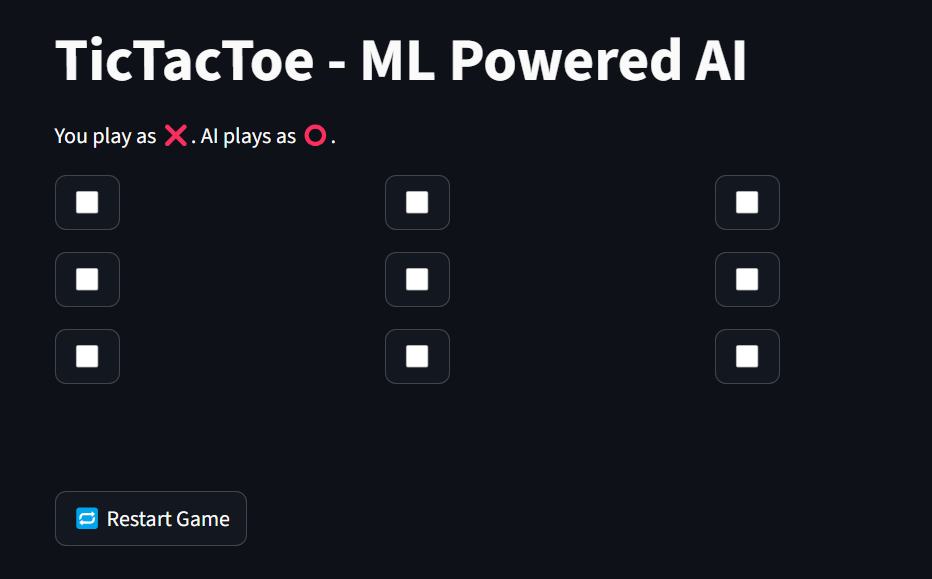
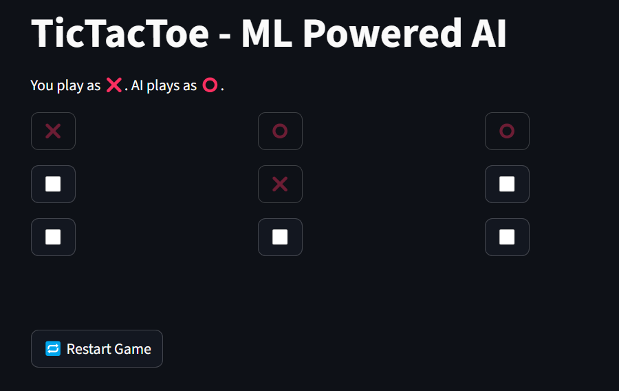
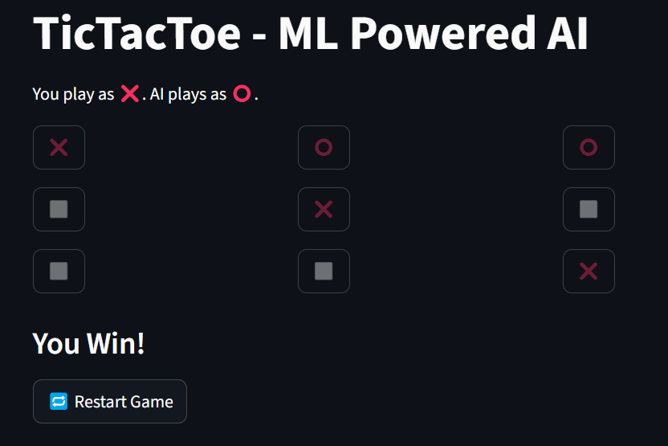

# Tic Tac Toe AI - MLPclassifier 

Play Tic Tac Toe against an AI trained using Machine Learning (MLP Classifier)!

##  Features
- Web-based UI built with Streamlit
- AI predicts best moves using a trained model
- Play as 'X', AI plays as 'O'

##  How to Run

1. **Install dependencies**:
```
pip install -r requirements.txt
```

2. **Train the model**:
```
python model.py
```

3. **Run the game**:
```
streamlit run app.py
```

## **Screenshots**

>Below are Screenshots of the project:







##  Author

Raagesh A
M.Tech. (Integrated) - Computer Science and Engineering (Data Science) 
VIT Vellore  

This project was built as part of a hands-on experience in supervised learning, game state encoding, neural network training with MLPClassifier, and deploying an interactive ML-powered Tic Tac Toe game using Streamlit.